# 🚀 BTC Mempaper

**A comprehensive, secure Bitcoin dashboard with web interface, real-time updates, and e-Paper display support.**

BTC Mempaper connects to your local (or public) mempool instance to visualize the Bitcoin network status, mine data from your Bitaxe, and display Bitcoin memes.

---

## 📸 Gallery

### Hardware Setup

<table>
  <tr>
    <td width="50%">
      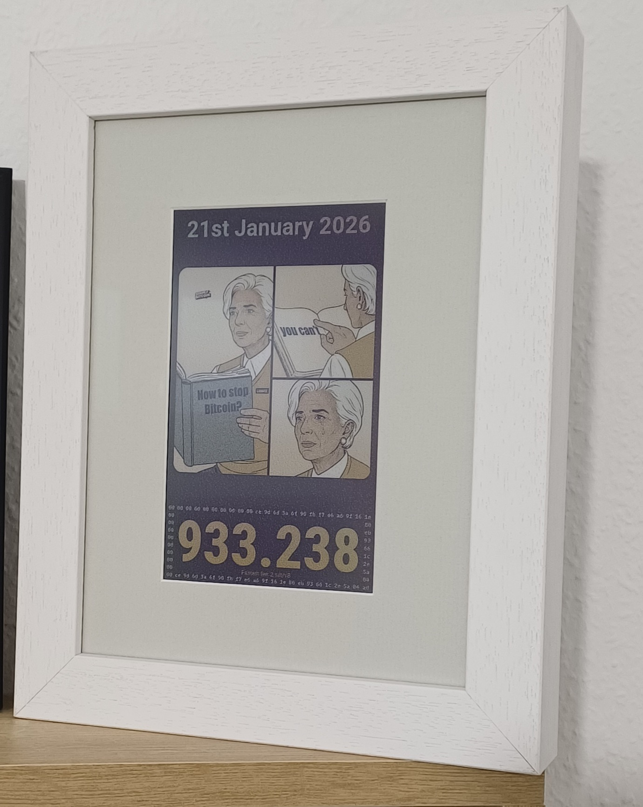
      <p align="center"><em>E-Paper Display - Dark Mode</em></p>
    </td>
    <td width="50%">
      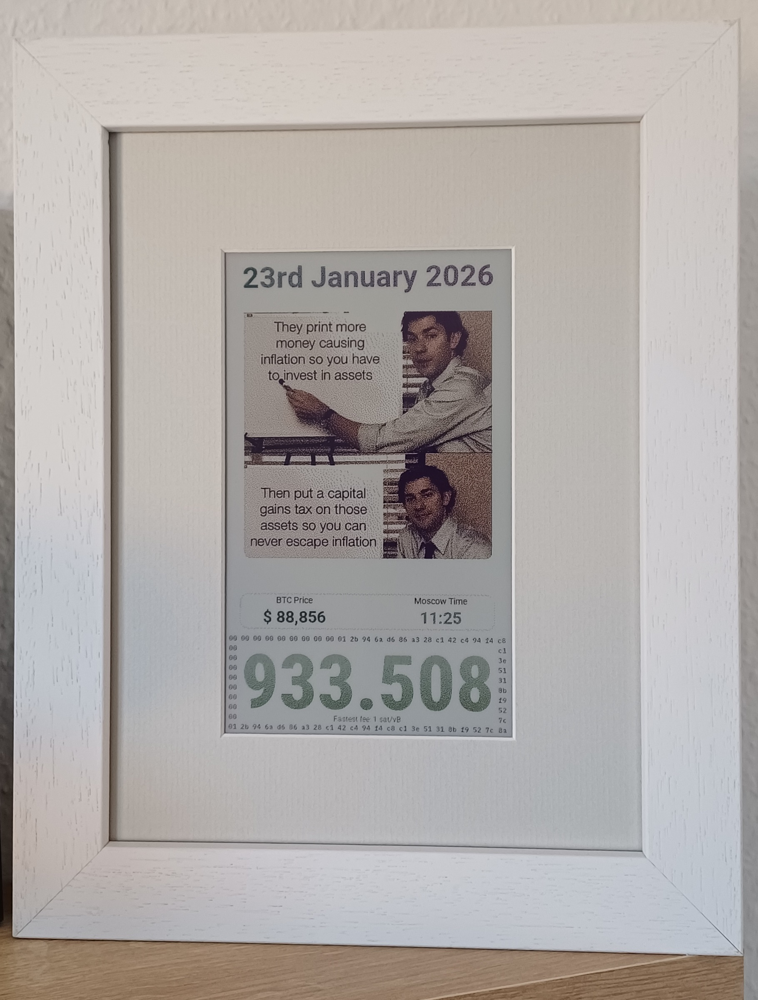
      <p align="center"><em>E-Paper Display - Light Mode</em></p>
    </td>
  </tr>
</table>

<details>
<summary><b>🔧 Assembly Photos</b> (Click to expand)</summary>

<p align="center">
  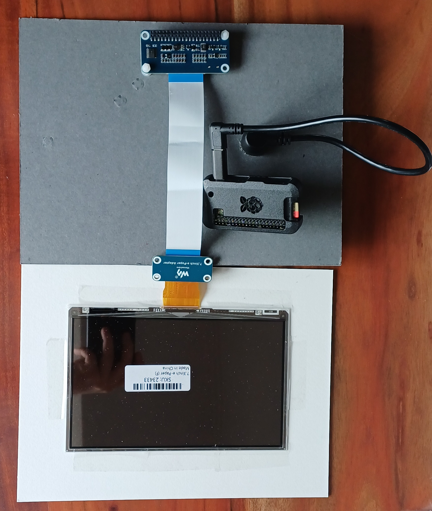
  <br/>
  <em>All components ready for assembly</em>
</p>

<p align="center">
  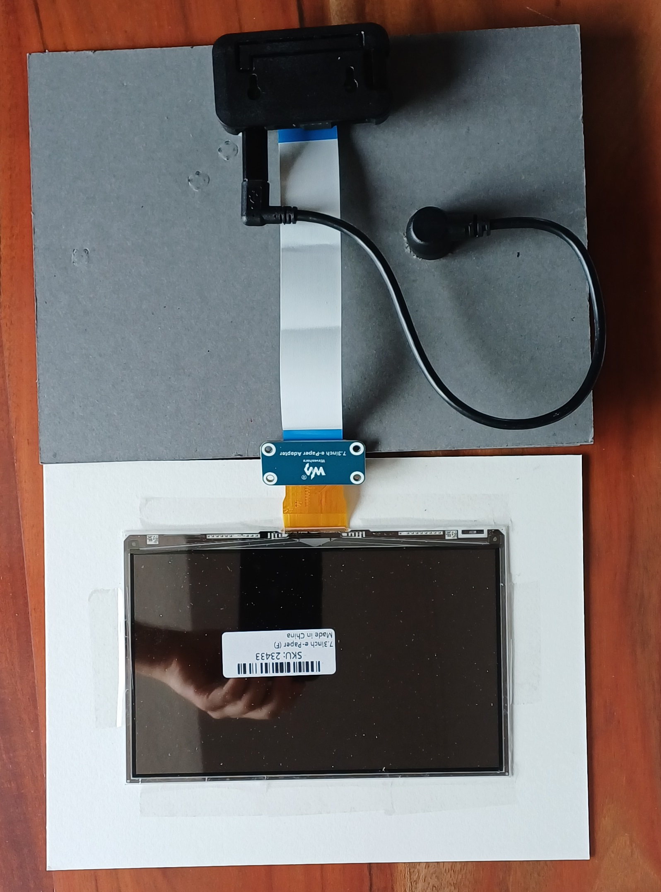
  <br/>
  <em>Raspberry Pi Zero W connected to e-Paper display via SPI Control interface</em>
</p>

<p align="center">
  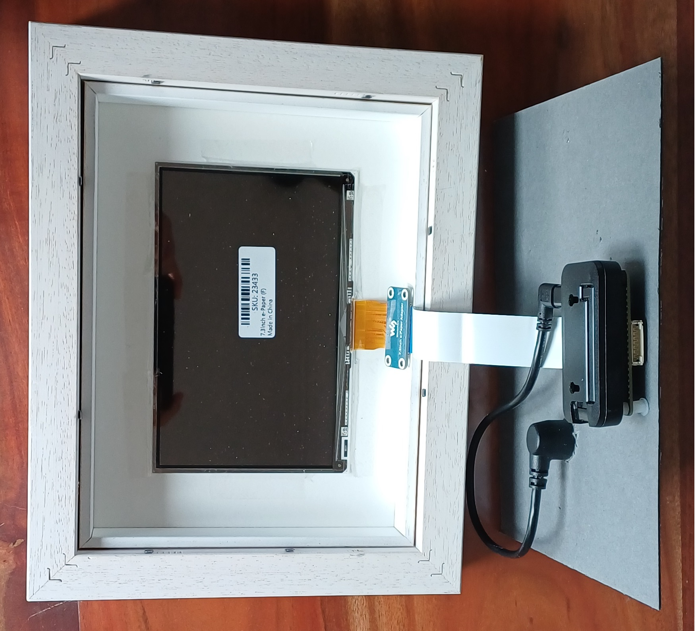
  <br/>
  <em>Mounting display in photo frame</em>
</p>

<p align="center">
  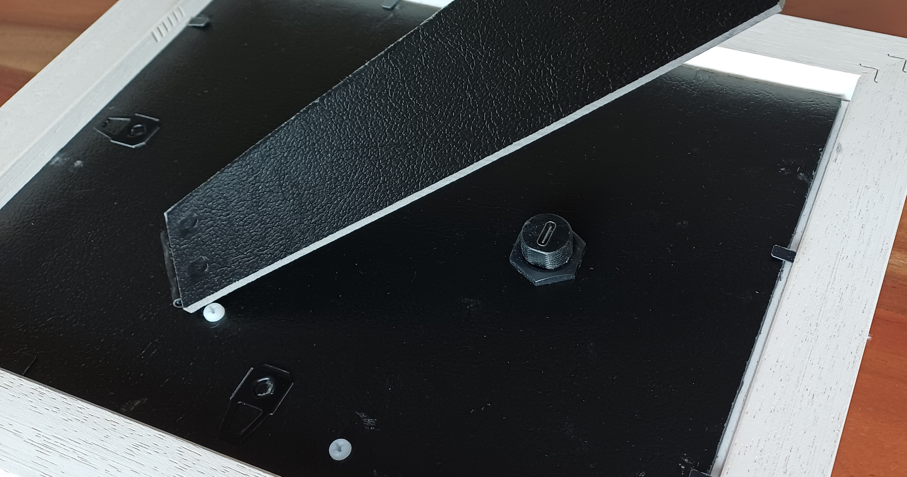
  <br/>
  <em>Photo frame back with USB-C power connector</em>
</p>

</details>

### Web Interface

<table>
  <tr>
    <td width="50%">
      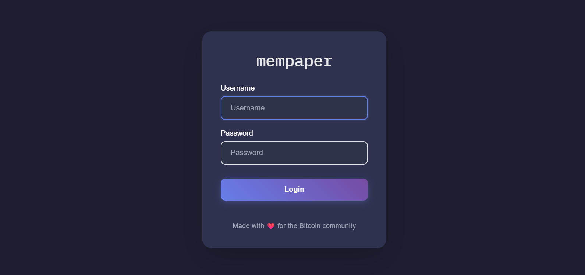
      <p align="center"><em>Secure login with Argon2id encryption</em></p>
    </td>
    <td width="50%">
      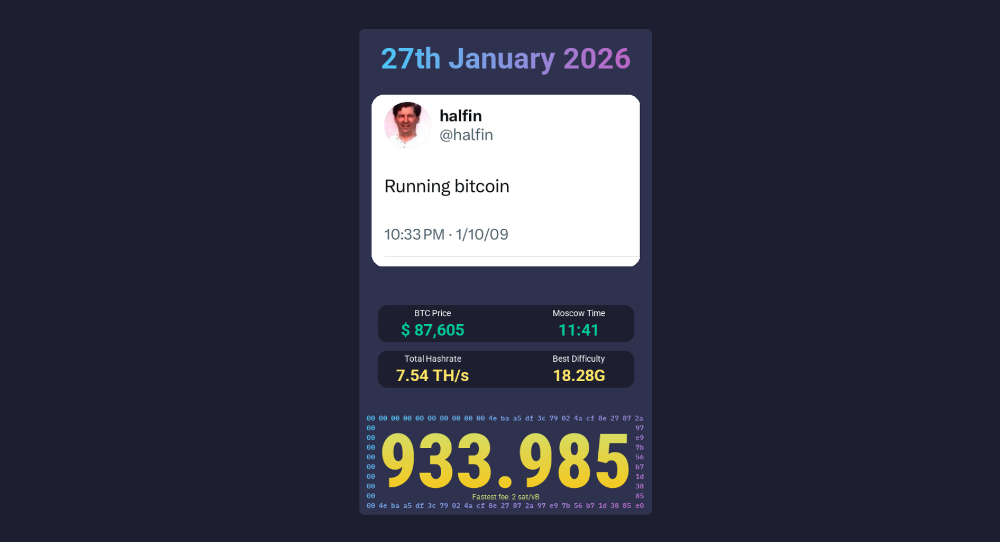
      <p align="center"><em>Dashboard - Dark Mode</em></p>
    </td>
  </tr>
  <tr>
    <td width="50%">
      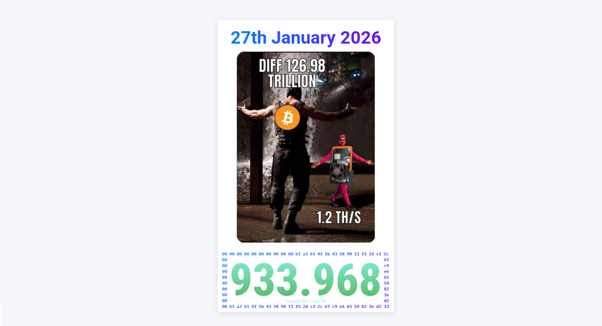
      <p align="center"><em>Dashboard - Light Mode</em></p>
    </td>
    <td width="50%">
      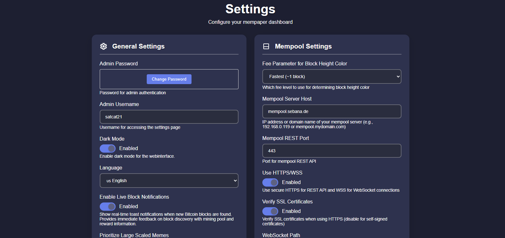
      <p align="center"><em>Configuration Settings</em></p>
    </td>
  </tr>
</table>

<details>
<summary><b>📋 System Logs</b> (Click to expand)</summary>

<p align="center">
  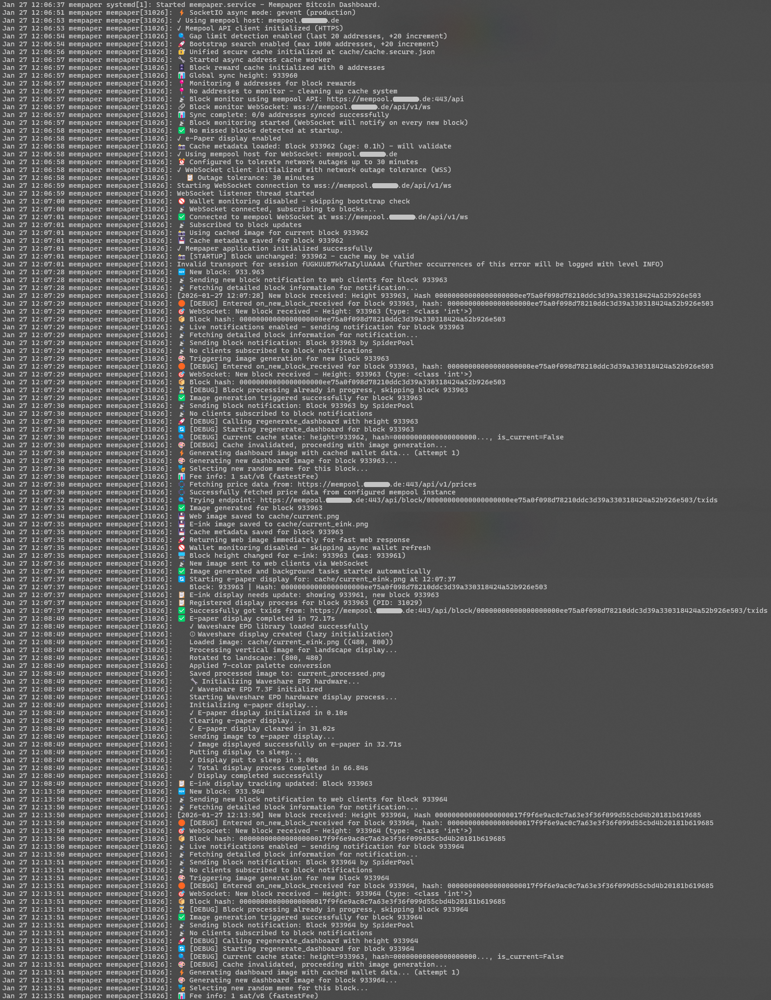
  <br/>
  <em>Real-time system logs showing WebSocket connections and block updates</em>
</p>

</details>

---

## 🛒 Shopping List

Here are the components needed to build your own Mempaper display:

| Component | Description | Estimated Price | Link |
|-----------|-------------|-----------------|------|
| **Raspberry Pi Zero 1 WH / 2 WH** | Main controller (512MB RAM, WiFi/BT) | ~21€ | [Raspberry Pi Zero 1 WH](https://www.berrybase.de/raspberry-pi-zero-wh) \| [Raspberry Pi Zero 2 WH](https://www.berrybase.de/raspberry-pi-zero-2-wh) |
| **Waveshare 7.3" e-Paper (F)** | 7-color e-ink display (800×480) | ~88€ | [Waveshare Official](https://www.waveshare.com/7.3inch-e-paper-hat-f.htm?srsltid=AfmBOorcEBNFbDLf1tDJAonJ3p7ACz8wrDXwkRo22J22eUblwLKQoO9Y) \| [Amazon](https://www.amazon.de/dp/B0C3R7Q75T) |
| **MicroSD Card** | 32GB or larger, Class 10 recommended | ~13€ | [SanDisk Extreme 64GB, Amazon](https://www.amazon.de/dp/B09X7CXWQQ) |
| **USB-C Power Supply** | 5V/2.5A minimum for Raspberry Pi Zero 2 W | ~10€ | |
| **USB-C to Micro-USB Adapter** | 2-pack adapter for power routing | ~4€ | [Amazon](https://www.amazon.de/dp/B0B7RMFMN4) |
| **90° USB-C Panel Mount Cable** | Right-angle USB-C extension for clean cable routing | ~15€ | [Amazon](https://www.amazon.de/dp/B0BQGBWVWM) |
| **Photo Frame** | 18x24cm frame for display mounting | ~47€ | [Solid wood picture frame with spacer strip, https://allesrahmen.de](https://www.allesrahmen.de/bilderrahmen-ystad-aus-massivholz-mit-distanzleiste-18x24-cmweiss-gemasert27-2043000.html) |
| **Passepartout (Mat Board)** | White/Tortora, 180x240mm outer, 94×158mm opening | ~17€ | [Passepartout, https://wandstyle.com](https://www.wandstyle.com/passepartout-bianco-naturale-30-x-40-cm/psta-254-030-040p-p1) |

**Total Cost:** ~215€

> **Note:** Prices are approximate and may vary by region and vendor. The Raspberry Pi Zero 2 W is recommended over the original Zero W for better performance.
> 
> **Cable Routing Components:** The USB-C to Micro-USB adapter and 90° panel mount cable allow you to cleanly route power from the Raspberry Pi to the back of the picture frame for a professional finish.
> 
> **Passepartout Dimensions:** The e-ink display has a visible area of 160×96mm. The passepartout opening is 158×94mm (2mm smaller on each side) to create a frame that holds the display securely in place.

---

## ✨ Features

- **Real-time Data**: Blocks, difficulty, hashrate, and fees from mempool.space integration.
- **Hardware Support**: Ready for Raspberry Pi (Zero/3/4/5) and Waveshare e-Paper displays (specifically 7.3" F).
- **Web Dashboard**: Responsive interface for configuration and monitoring.
- **Miner Integration**: Monitor Bitaxe miner stats and aggregate hashrate.
- **Wallet Monitoring**: Track balances and block rewards (XPUB support included).
- **Security**: Argon2id password hashing, rate limiting, and encrypted configuration.

---

## 🚀 Quick Start

### 1. Installation

**Raspberry Pi / Linux**
```bash
# Install system dependencies
sudo apt update && sudo apt upgrade -y
sudo apt install -y libffi-dev build-essential python3-pip python3-pil python3-dev python3-numpy python3-gpiozero libopenjp2-7 pkg-config

# Clone and install
git clone https://github.com/satcat21/btc-mempaper.git
cd btc-mempaper
python3 -m venv .venv
source .venv/bin/activate
pip3 install spidev gpiozero lgpio
pip install -r requirements.txt
```

**PC / Windows**
```powershell
# Clone and install
git clone https://github.com/satcat21/btc-mempaper.git
cd btc-mempaper
python -m venv venv
.\venv\Scripts\Activate.ps1
pip install -r requirements.txt
```

### 2. Setup (All Platforms)

1. **Create Configuration**
   ```bash
   cp config/config.json.example config/config.json
   # Windows: copy config\config.json.example config\config.json
   ```

   > **⚠️ IMPORTANT:** Open `config/config.json` now.
   > - Change `admin_username` if you don't want the default "admin".
   > - Review other keys: `language`, `web_orientation`, `eink_orientation`, `mempool_host` etc.
   ```bash
   nano config/config.json
   ```

2. **Application Setup and Service Configuration**

   ```bash
   # Download memes
   python initialize_memes.py

   # Start application to set admin user password for web login
   python serve.py
   ```
   Complete the initial password setup via CLI.

   Access the dashboard at [http://mempaper-ip:5000](http://mempaper-ip:5000)
   
   **After setup is complete**, press `Ctrl+C` to stop the server.

3. **Enable Background Service (Linux Systems)**

   For production use, run Mempaper as a systemd service (auto-starts on boot).
   
   **Generate the service file** (automatically configures paths and user):
   
   ```bash
   # Generate service file for your installation
   python scripts/generate_service_file.py
   
   # Review the generated file
   cat mempaper.service
   
   # Copy to system directory
   sudo cp mempaper.service /etc/systemd/system/
   
   # Reload systemd to recognize the new service
   sudo systemctl daemon-reload
   
   # Enable and start the service
   sudo systemctl enable mempaper.service
   sudo systemctl start mempaper.service
   
   # Check status
   sudo systemctl status mempaper.service
   ```
   
   The dashboard will be accessible at [http://mempaper-ip:5000](http://mempaper-ip:5000).
   
   **Service Management:**
   ```bash
   # View live logs
   sudo journalctl -u mempaper.service -f
   
   # Restart after config changes
   sudo systemctl restart mempaper.service
   
   # Stop service
   sudo systemctl stop mempaper.service
   
   # Disable service from auto-start
   sudo systemctl disable mempaper.service
   ```

---

## 🖥️ Display Setup (Raspberry Pi)

Mempaper supports Waveshare e-Paper displays. The **Waveshare 7.3inch F (7-color)** is the primary target.

### 1. Enable SPI Interface
Crucial for the display to communicate with the Pi.
```bash
sudo raspi-config
# Navigate to: 3 Interface Options -> I4 SPI -> Yes
```

### 2. Install Display Drivers

**Option A: Waveshare Native (Recommended)**
This is the most stable method for the 7.3" (F) display.

```bash
# 1. Clone the drivers
cd ~
git clone https://github.com/waveshare/e-Paper.git

# 2. Test the connection
cd e-Paper/RaspberryPi_JetsonNano/python/examples
python3 epd_7in3f_test.py
```
*If the test script updates your screen, the hardware is working.*

**Option B: Omni-EPD**
Use this if you need support for many different display types or prefer the abstraction layer.

```bash
git clone https://github.com/robweber/omni-epd.git
cd omni-epd
pip3 install --upgrade pip setuptools wheel
pip3 install --prefer-binary .
```

### Configure Mempaper
Run the configuration tool to select your discovered display:
```bash
python configure_display.py
```

> **Note:** Service setup is covered in the [Quick Start](#-quick-start) section above.

---

## 📂 Project Structure

The codebase is organized into functional modules for better maintainability:

```
btc-mempaper/
│
├── 🎯 Entry Points
│   ├── mempaper_app.py        # Main Flask application (core logic)
│   ├── serve.py               # Development server (quick start)
│   ├── wsgi.py                # Production WSGI entry point
│   └── gunicorn.conf.py       # Production server configuration
│
├── 📚 lib/                    # Core Business Logic
│   ├── mempool_api.py         # Mempool.space API client
│   ├── btc_price_api.py       # Bitcoin price data
│   ├── bitaxe_api.py          # Bitaxe miner integration
│   ├── wallet_balance_api.py  # Wallet balance & XPUB tracking
│   ├── block_monitor.py       # Block height monitoring
│   ├── block_reward_cache.py  # Persistent block reward storage
│   ├── image_renderer.py      # Dashboard image generation (2000+ lines)
│   ├── display_subprocess.py  # Display refresh handler
│   ├── websocket_client.py    # Real-time mempool WebSocket
│   ├── address_derivation.py  # HD wallet address derivation
│   └── btc_holidays.py        # Bitcoin historical events
│
├── ⚙️  managers/              # Configuration & Security
│   ├── config_manager.py      # Configuration management
│   ├── config_observer.py     # Config change monitoring & cache rebuilding
│   ├── auth_manager.py        # Authentication & rate limiting
│   ├── secure_config_manager.py     # Encrypted configuration storage
│   ├── secure_password_manager.py   # Argon2id password hashing
│   ├── secure_cache_manager.py      # Encrypted cache files
│   ├── unified_secure_cache.py      # Unified cache encryption
│   └── mobile_token_manager.py      # Mobile API token management
│
├── 🛠️  utils/                 # Utilities & Helpers
│   ├── translations.py        # Multi-language support (en, de, es, it, fr)
│   ├── color_lut.py           # E-Paper color palette mapping
│   ├── epd_color_fix.py       # Waveshare 7-color optimizations
│   ├── privacy_utils.py       # Bitcoin address masking for logs
│   ├── security_config.py     # Security constants & settings
│   └── technical_config.py    # Technical constants & defaults
│
├── 🔧 scripts/                # Administration & Setup
│   ├── configure_display.py   # Display configuration wizard
│   ├── initialize_memes.py    # Download Bitcoin memes
│   ├── backup_manager.py      # Backup & maintenance utility
│   ├── start_fast.py          # Quick development start
│   ├── start_pc.py            # PC-specific startup
│   └── reset_cache_rpi.sh     # Cache reset for Raspberry Pi
│
├── 🖥️  display/               # Display Drivers & Config
│   ├── waveshare_display.py   # Native Waveshare driver integration
│   ├── show_image.py          # Image display handler
│   ├── prepare_image.py       # Image preparation pipeline
│   └── waveshare_epd.epd7in3f.ini  # 7.3" F display configuration
│
├── 📁 Data & Configuration
│   ├── config/                # User configuration
│   │   ├── config.json        # Main config (created from .example)
│   │   └── config.secure.json # Encrypted sensitive data
│   ├── cache/                 # Runtime cache storage
│   │   └── *.secure.json      # Encrypted cache files
│   ├── static/                # Web assets (CSS, JS, images)
│   │   └── memes/             # Bitcoin meme collection
│   └── templates/             # HTML templates for web interface
│
├── 📖 Documentation
│   ├── README.md              # This file
│   ├── docs/                  # Additional documentation
│   │   ├── CONFIG_REFERENCE.md
│   │   ├── SECURITY_GUIDE.md
│   │   └── UNIFIED_CACHE_DOCUMENTATION.md
│   └── mempaper.service       # Systemd service configuration
│
└── 🔐 Project Files
    ├── requirements.txt       # Python dependencies
    ├── omni-epd.ini           # Optional omni-epd configuration
    └── LICENSE                # GPL-3.0 license
```

**Architecture Overview:**
- **Entry Points** → Load configuration → Initialize **lib/** APIs → Render via **display/**
- **managers/** handle all security, authentication, and configuration management
- **utils/** provide shared functionality across the application
- **scripts/** are standalone tools for setup and maintenance

---

## ⚙️ Configuration

Navigate to **Settings** in the web interface ([http://mempaper-ip:5000](http://mempaper-ip:5000)).

- **Mempool Connection**: Default is `mempool.space`. Change IP/Port to use a local node or point to hostname of self-hosted mempool instance.
- **Display**: Toggle "E-Ink Display Connected" to ON.
- **Bitaxe**: Add miner IPs to monitor hashrate.

For advanced manual configuration, edit `config/config.json`.

📖 **See [Configuration Reference](docs/CONFIG_REFERENCE.md) for detailed explanation of all settings.**

---

## 📚 Documentation

**Configuration:**
- [Configuration Reference](docs/CONFIG_REFERENCE.md) - Complete guide to all settings

**Security:**
- [Security Guide](docs/SECURITY_GUIDE.md) - Encryption and password protection

**Developer Resources:**
- [Cache System Documentation](docs/UNIFIED_CACHE_DOCUMENTATION.md) - Technical cache implementation details

---

## ⚡ Support the Project

If you find this project useful and want to support its development, you can send a Lightning tip:

<p align="center">
  
  <br/>
  <code>khakioctopus15@primal.net</code>
</p>

Every sat helps keep the project maintained and adds new features! 🙏

---

## License

GNU General Public License v3.0 (GPLv3)
