## Architecture

How mempaper is wired: where its block, fee and mempool data comes from, what
leaves the device, how the code is organised, and how a new block becomes a
rendered image.

---

### Contents

- [Deployment topologies](#deployment-topologies)
  - [A — Public mempool.space](#a--public-mempoolspace)
  - [B — Public mempool.space behind a VPN](#b--public-mempoolspace-behind-a-vpn)
  - [C — Self-hosted mempool](#c--self-hosted-mempool)
  - [D — mempool.space over Tor](#d--mempoolspace-over-tor)
  - [What your ISP sees](#what-your-isp-sees)
  - [Summary](#summary)
  - [Pros and cons](#pros-and-cons)
- [Remote access (bonus)](#remote-access-bonus)
- [What leaves the device](#what-leaves-the-device)
- [Codebase map](#codebase-map)
- [From new block to new image](#from-new-block-to-new-image)
- [Timings](#timings)

---

### Deployment topologies

Almost the entire privacy posture comes down to one setting. Every mempool call
resolves to whatever `mempool_host` points at. Everything else is either
LAN-local or optional and off by default:

| Destination | What for | Default |
|---|---|---|
| `mempool_host` | blocks and the block WebSocket, fees, prices, hashrate, difficulty | **required** — the core dashboard |
| `mempool_host` | **addresses** (wallet balances), txids (block-reward matching) | **off** — both opt-in |
| Bitaxe miners | miner stats over private LAN IPs — never routable off your network | off |
| your webhook relay | inbound Lightning donation events | off |
| `api.github.com` | update check against the release list, default `satcat21/btc-mempaper` | off — falls back to local git tags |
| `einundzwanzig-memes.space` | weekly meme sync | off |

Worth separating those first two rows: the calls that carry anything about *you*
are the opt-in ones. A stock install queries public chain data only. Address
lookups begin when you enable the wallet balances block, and txid scanning when
you add block-reward addresses — so the privacy discussion below matters in
proportion to how much of your own data you have asked it to display.

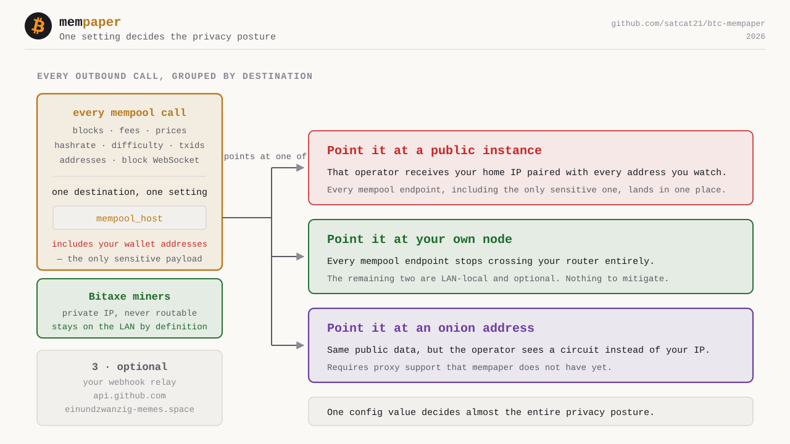

#### A — Public mempool.space

The default, and the least work: no infrastructure of your own. The cost is that
the instance operator sees your home IP paired with every address you ask about.

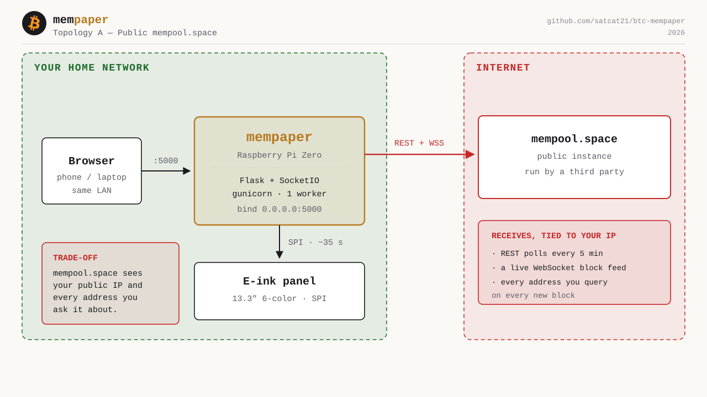

#### B — Public mempool.space behind a VPN

The reflex fix for option A, and the only one needing no application changes: the
tunnel is transparent to mempaper, which keeps talking to mempool.space exactly
as before.

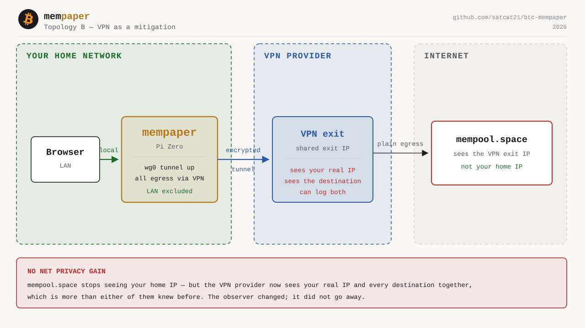

**It moves the exposure rather than removing it.** mempool.space stops seeing
your home IP — but the VPN provider now sees your real IP *and* every destination
you reach, which is more than either of them knew before. One company ends up
holding both halves, on nothing but its own assurance that it keeps no logs.

The query itself is untouched: mempool.space still receives your full address set
as one correlated cluster, simply arriving from a different IP.

Reasonable if you already run a VPN you trust and want it to cover this too. Not
worth introducing for mempaper alone.

#### C — Self-hosted mempool

Point `mempool_host` at your own node and the queries stop crossing your router
altogether. Only bitcoind's peer-to-peer traffic leaves, and that carries no
information about which addresses you care about.

This is the recommended setup if you display wallet balances — the only option
that removes the query rather than disguising who sent it.

**Leave `mempool_use_tor` off here.** Tor refuses to route private addresses, so
with the toggle on a `192.168.x.x` host fails outright rather than merely running
slowly — and there is nothing to gain, since the traffic never leaves the LAN. It
also spares a single-core Pi the `tor` daemon.

Do not confuse that with running the node itself over Tor. They are different
hops:

| Hop | Controlled by | In topology C |
|---|---|---|
| node ↔ Bitcoin P2P network | `onlynet=onion` in `bitcoin.conf` | your choice — see [What your ISP sees](#what-your-isp-sees) |
| mempaper ↔ mempool host | `mempool_use_tor` in mempaper | **off** — plain HTTP across your LAN |

A Tor-only node still answers mempaper over ordinary HTTP on the local network.

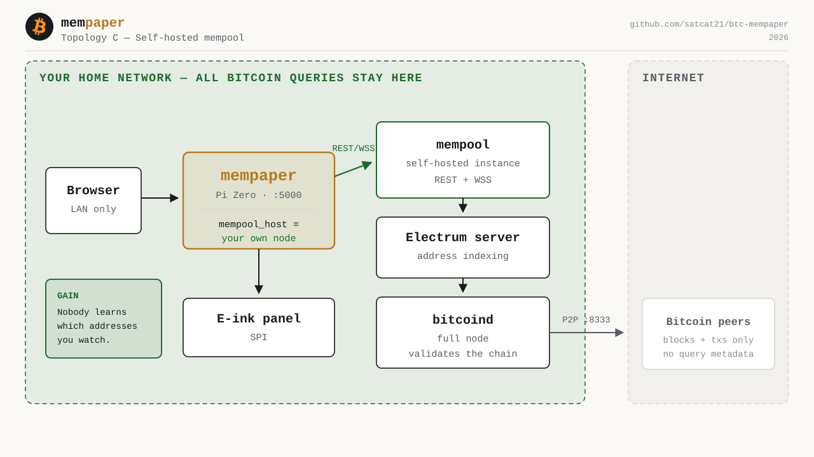

#### D — mempool.space over Tor

A middle path for people who cannot self-host: reach mempool.space through its
onion service, so the operator sees a Tor circuit instead of your IP.

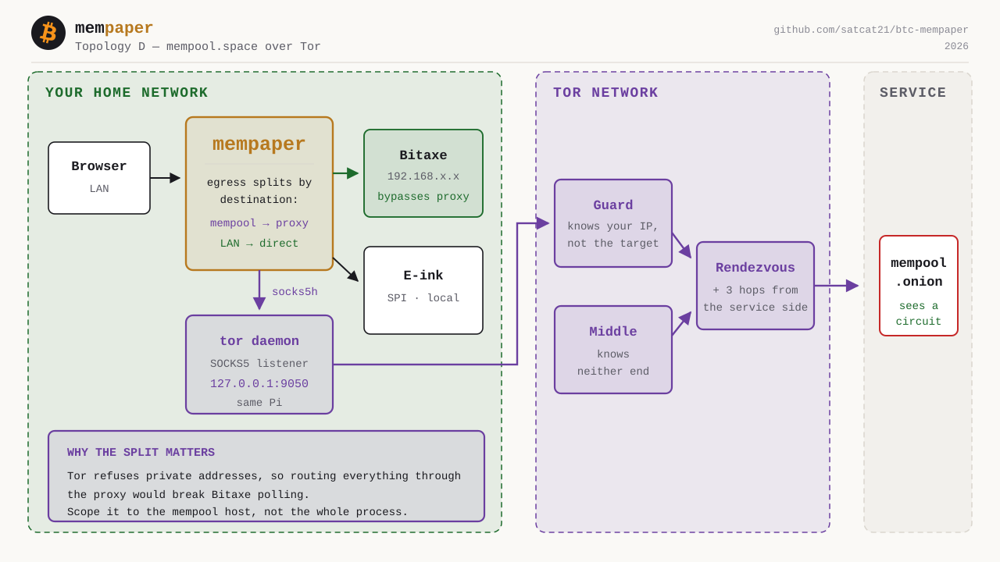

Tor covers the mempool traffic, and meme downloads can be routed over it too
(`sync_memes.py --tor`). LAN destinations such as Bitaxe miners are not
proxied.

#### E — Self-hosted, with storage sealed to a Tang server

A through D all concern what leaves the device over the network. None of them
help once the device itself leaves your house: wallet addresses sit on the SD
card in the clear, and anything the Pi could derive a key from, an attacker
holding the Pi can derive it from too.

Topology E adds the one key that is genuinely not on the card. mempaper seals
its wallet data with `clevis` against a [Tang](https://github.com/latchset/tang)
server elsewhere on the LAN, and can unseal only while that server answers.

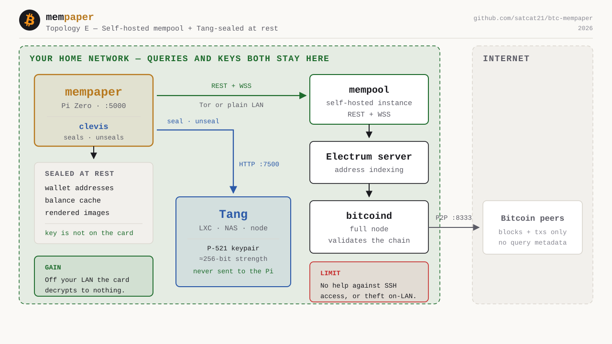

This is orthogonal to A–D — Tang works just as well pointed at mempool.space —
but it composes with C into the strongest configuration available: no query
leaves the network, and the device is worthless off it. Setup, sizing and the
failure modes are in the
[Self-Hosting Guide → Tang](SELF_HOSTING_GUIDE.md#part-8--tang-network-bound-encryption-for-wallet-data-optional).

#### What your ISP sees

Everything above concerns what the *mempool operator* learns. Your ISP is a
separate observer with a different view, and the ranking is not the same.

The ISP never sees request contents — TLS handles that in every option. What it
does see is **who you connect to, when, and how much**. Three distinctions matter:

- **A (public).** The destination IP is mempool.space, and the TLS handshake
  carries the hostname in cleartext via SNI. If you also use your ISP's DNS
  resolver, the lookup is visible before the connection even opens. Your ISP can
  reasonably conclude you follow Bitcoin. It cannot see which addresses.
- **B (VPN) and D (Tor).** Both hide the destination: the ISP sees an encrypted
  tunnel to a VPN endpoint or a Tor guard, and nothing past it. Both also reveal
  *that* you use a VPN or Tor, since those endpoint addresses are public. You are
  trading a specific signal for a generic one.
- **C (self-hosted) with a clearnet node.** This is the counterintuitive one.
  Your mempool queries stop crossing the router entirely — but bitcoind now holds
  **continuous peer connections on port 8333**, which is a far louder and more
  persistent signal to the ISP than occasional visits to mempool.space. In this
  configuration self-hosting is the strongest option against the mempool operator
  and the *most* visible to your ISP.
- **C with a Tor-only node.** That inverts once bitcoind peers exclusively over
  Tor (`onlynet=onion` plus a `proxy=` line in `bitcoin.conf`). There is then no
  clearnet 8333 traffic at all, and the ISP sees sustained Tor usage rather than
  a Bitcoin node. This is the only combination that hides both the query *and*
  the fact that it is Bitcoin. The cost is peering only with onion nodes: slower
  initial sync, and reachability depending on those peers.

  This is a `bitcoin.conf` setting, not a mempaper one — it changes how your
  **node reaches the Bitcoin network**, and has no bearing on how mempaper
  reaches your node. `mempool_use_tor` stays off either way; mempaper still
  talks plain HTTP to the node across your LAN.

So the two threat models pull in opposite directions, and which option wins
depends on how bitcoind itself is peered. If your concern is the mempool operator
correlating your addresses, self-host. If it is your ISP knowing you touch
Bitcoin at all, self-hosting with a default clearnet node makes that worse rather
than better — a Tor-only node is the answer, and it is configured in bitcoind,
not in mempaper.

Worth being clear about the limit: **no option here hides that you are sending
traffic**. Volume and timing remain visible in all four. These differ in what the
traffic reveals, not in whether it exists.

#### Summary

| | A — Public | B — VPN | C — Self-hosted | D — Tor |
|---|---|---|---|---|
| **Sees your IP** | mempool.space + ISP | VPN provider | nobody | entry guard only, and it cannot see the destination |
| **Sees your addresses** | mempool.space | mempool.space | nobody | mempool.space, but unlinked from an IP |
| **Your ISP sees** | that you use mempool.space | that you use a VPN, nothing past it | **that you run a Bitcoin node** — unless bitcoind peers Tor-only, then just Tor usage | that you use Tor, nothing past it |
| **Effort** | none | low, OS-level | high — a node plus initial chain sync | medium — install Tor, flip one setting |
| **Added latency** | — | ~50 ms | near zero (LAN) | 1–4 s |
| **Ongoing cost** | none | usually a subscription | hardware, power, disk | none |
| **Fails when** | your line drops | tunnel drops, killing all egress | your node is down — but nothing leaked either | a circuit breaks; reconnects on the usual 30 s backoff |

Latency is the usual objection to Tor, and it does not survive contact with
the numbers: Tor adds 1–4 s to events arriving roughly every 600 s, feeding a
panel that takes ~35 s to redraw.

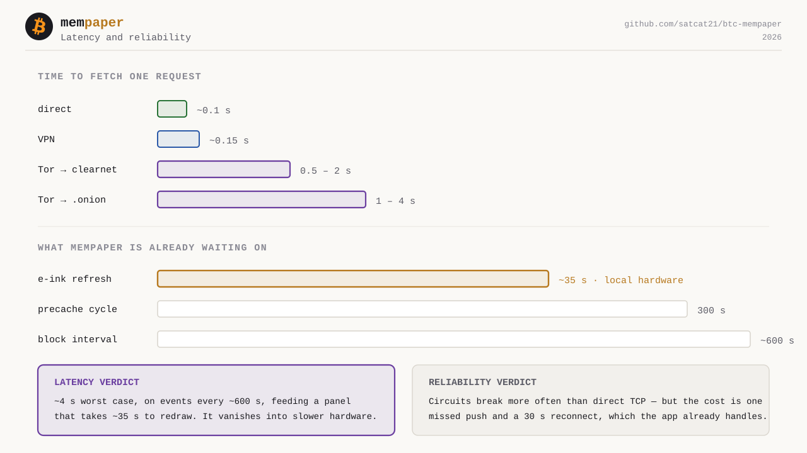

#### Pros and cons

- **A — Public.** *Pro:* works out of the box, nothing to run or maintain.
  *Con:* one operator gets your home IP paired with every address you watch,
  which is the worst combination of the four. Fine if you display no wallet
  balances; poor if you do.
- **B — VPN.** *Pro:* no application changes, and covers every app on the device
  rather than just this one. *Con:* moves the trust instead of removing it — one
  provider now sees your IP and your destinations together. Still leaks the
  address set. Weakest mitigation here.
- **C — Self-hosted.** *Pro:* the only option that eliminates the query, so
  neither your IP nor your addresses go anywhere. Lowest latency too, since it is
  on the LAN. *Con:* by far the most to run — a machine, a full chain sync, and
  ongoing maintenance. If it is down, you have no data.
- **D — Tor.** *Pro:* hides your IP without trusting any single party, costs
  nothing, and the added latency is invisible on a dashboard that redraws every
  ~10 minutes. *Con:* circuits break more often than a direct connection, and the
  address set still reaches mempool.space — anonymously, but as one cluster.

The distinction that matters: Tor and a VPN hide *who* is asking. Neither hides
*what* is asked — your address set still arrives as one correlated cluster.
Only self-hosting removes the query.

Ordered by privacy strength rather than by letter, that is **self-hosted (C)**,
then **Tor (D)**, then **VPN (B)**, then **public mempool.space (A)**. The
letters are presentation order, not a ranking.

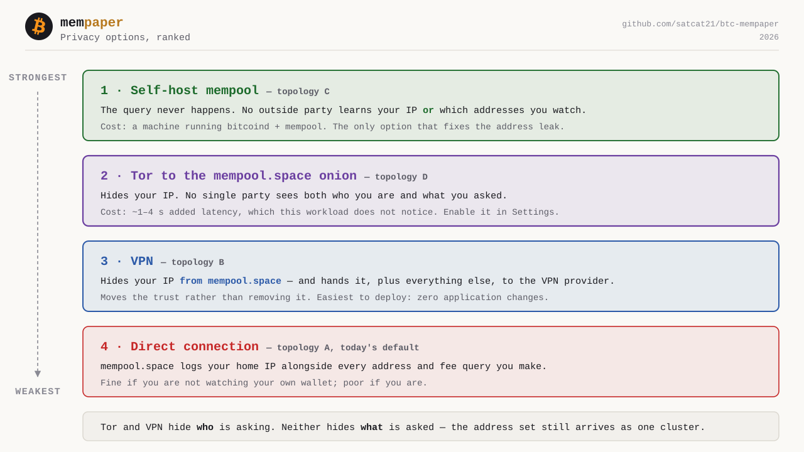


---

### Remote access (bonus)

Everything above is about traffic *leaving* the device. This is the opposite
direction: reaching the dashboard from outside your own network. It is entirely
optional — mempaper is perfectly happy being LAN-only, and that is the safest
posture.

> **Full walkthrough: [Self-Hosting Guide](SELF_HOSTING_GUIDE.md)** — Zitadel and
> Traefik via Docker Compose, TLS certificates, exposing a self-hosted mempool,
> and relaying Lightning donations over the internet. The summary here is only
> the shape of it.

Do not forward port 5000. Put a reverse proxy in front, terminate TLS there, and
authenticate before anything reaches the app.

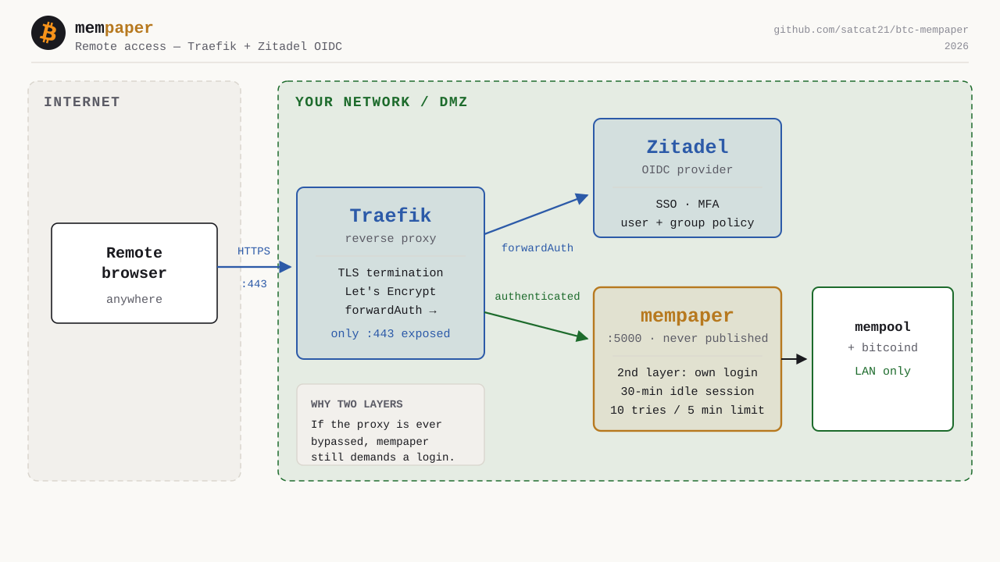

> The diagram is a simplified overview. In the real routing, `/socket.io/*`
> **bypasses OIDC** — a WebSocket upgrade cannot follow an authentication
> redirect. See the guide for the exact router rules.

Two layers, deliberately. Traefik terminates TLS and hands authentication to
Zitadel, so unauthenticated traffic never reaches mempaper at all. Behind that,
mempaper's own login stays enabled: a 30-minute idle session and a
10-attempts-per-5-minutes rate limit. If the proxy is ever bypassed or
misconfigured, the app still demands credentials rather than trusting that
something upstream already checked.

---

### What leaves the device

Every outbound call in the codebase. `{mempool}` is whatever `mempool_host`
points at.

| Endpoint | Destination | What is sent | Cadence |
|---|---|---|---|
| `WSS /api/v1/ws` | `{mempool}` | `{"action":"want","data":["blocks"]}` | persistent |
| `GET /blocks/tip/height`, `/blocks/tip/hash` | `{mempool}` | nothing | on block |
| `GET /block/{hash}/txids` | `{mempool}` | block hash | on block |
| `GET /v1/fees/precise`, `/v1/fees/recommended` | `{mempool}` | nothing | 5 min |
| `GET /v1/prices` | `{mempool}` | nothing | 5 min |
| `GET /v1/mining/hashrate/1m`, `/v1/difficulty-adjustment` | `{mempool}` | nothing | 5 min |
| `GET /address/{addr}` | `{mempool}` | **each derived address** | on block |
| `GET /api/system/info` | Bitaxe miner (LAN) | nothing | 5 min |
| `WSS {relay}` | webhook relay | listens only | persistent, opt-in |
| `GET /repos/{repo}/releases` | api.github.com | repo path, token if set | on demand, opt-in |
| meme sync | einundzwanzig-memes.space | nothing | weekly, opt-in |

Two things worth knowing:

- **Your extended public key never leaves the device.** Address derivation from
  an xpub/zpub runs locally in `lib/address_derivation.py`; only the individual
  derived addresses are ever queried. `GET /address/{addr}` is the one call that
  carries anything sensitive.
- **There is no third-party price API.** Price comes from `/v1/prices` on the same
  mempool instance, so self-hosting removes it too — no exchange or data broker is
  contacted.

Inbound, the only non-browser endpoint is
`POST /api/donation-webhook/{token}`, where the token in the path is the shared
secret.

---

### Codebase map

Four layers: adapters bring data in, one orchestrator schedules everything, one
renderer produces both images, two sinks deliver them.

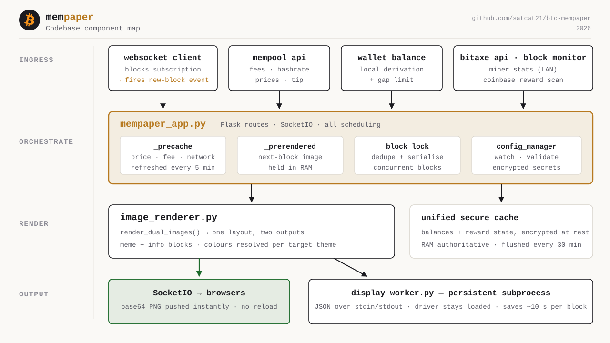

`mempaper_app.py` holds the scheduling state that the rest of the system turns on:

| State | Purpose |
|---|---|
| `_precache` | Price, fee and network data, refreshed on a 5-minute cycle |
| `_prerendered` | The next block's image, rendered ahead of time and held in RAM |
| block lock | Rejects duplicate and out-of-order block events |
| `config_manager` | Watches and validates config, splits sensitive fields into their own file |

The renderer produces the web and e-ink images from a single layout pass, with
colors resolved separately per target — that is why `eink_dark_mode` is
independent of the web theme.

The display worker is a **persistent subprocess** speaking newline-delimited JSON
over stdin/stdout. Keeping it alive between blocks avoids re-importing the
Waveshare driver every time, which saves roughly 10 s per refresh. It reads its
config once at startup and does not pick up live changes, so a change of display
type restarts it.

<details>
<summary><b>Directory layout</b> — where each of those layers lives on disk</summary>

```
btc-mempaper/
|
|-- Entry Points
|   |-- mempaper_app.py          Orchestrator: startup, scheduling, hotspot, display
|   |-- serve.py                 Development server (quick start)
|   |-- wsgi.py                  Production WSGI entry point
|   +-- gunicorn.conf.py         Production server configuration
|
|-- routes/                      HTTP surface, one module per area
|   |                            Each exposes register(self); MempaperApp calls
|   |                            them all from _setup_routes
|   |-- setup.py                 Onboarding: hotspot, captive portal, /api/setup/*
|   |-- static_assets.py         Static serving, cache headers, dist/ fallback
|   |-- pages.py                 Dashboard, config and login pages, /image
|   |-- auth.py                  Login, logout, sessions, admin users, webhook
|   |-- config_api.py            Read/write config, mempool validation
|   |-- media.py                 Meme and OPSec upload, listing, thumbnails
|   |-- wallet.py                On-chain balances and block-reward lookups
|   |-- bitaxe.py                Miner telemetry (best difficulty per device)
|   |-- system.py                Health, saved Wi-Fi, power control, SSH keys
|   |-- updates.py               Releases, software update, display drivers
|   +-- sockets.py               SocketIO event handlers
|
|-- services/                    MempaperApp behaviour, one mixin per area
|   |                            MempaperApp inherits all of them, so each
|   |                            method keeps the same self and call sites
|   |-- wifi.py                  Wi-Fi, setup hotspot, captive portal, recovery
|   |-- donations.py             Lightning donation state and webhook listener
|   |-- recovery.py              Power-cycle detection and factory reset
|   |-- display_worker.py        The persistent e-ink worker subprocess
|   |-- caching.py               Cached images, precache loop, prerendering
|   +-- updates.py               Scheduled updates, deferred Pillow rebuild
|
|-- lib/                         Core Business Logic
|   |-- mempool_api.py           Mempool.space API client
|   |-- btc_price_api.py         Bitcoin price data
|   |-- bitaxe_api.py            Bitaxe miner integration
|   |-- wallet_balance_api.py    Wallet balance & XPUB tracking
|   |-- block_monitor.py         Block height monitoring
|   |-- block_reward_cache.py    Persistent block reward storage
|   |-- image_renderer.py        Layout orchestration and the info blocks
|   |-- display_subprocess.py    Display refresh handler
|   |-- websocket_client.py      Standalone client, used by tools/backup_manager
|   |-- address_derivation.py    HD wallet address derivation
|   +-- btc_holidays.py          Bitcoin historical events
|
|-- lib/render/                  ImageRenderer method groups, as mixins
|   |-- dual_images.py           The two public entry points (web + e-ink)
|   |-- colors.py                Theme lookup and e-paper quantisation
|   |-- memes.py                 Meme/OPSec selection, cache, tags, cropping
|   |-- hash_frame.py            Block-hash frame and the info drawn in it
|   |-- text.py                  Wrapping, truncation, emoji-aware measurement
|   +-- formatting.py            Fee colors, localised dates, date font size
|
|-- managers/                    Configuration & Security
|   |-- config_manager.py        Load, save and watch config
|   |-- config_schema.py         Web UI form schema (fields, labels, options)
|   |-- config_validation.py     Validation, incl. the mempool transport slots
|   |-- config_observer.py       Config change monitoring
|   |-- auth_manager.py          Authentication & rate limiting
|   |-- secure_config_manager.py Encrypted configuration storage
|   |-- secure_password_manager.py   Argon2id password hashing
|   |-- secure_cache_manager.py  Encrypted cache files
|   +-- unified_secure_cache.py  Unified sensitive-data cache
|
|-- utils/                       Utilities & Helpers
|   |-- translations.py          Multi-language support (en, de, es, it, fr)
|   |-- color_lut.py             E-Paper color palette mapping
|   |-- epd_color_fix.py         Waveshare 7-color optimizations
|   |-- privacy_utils.py         Bitcoin address masking for logs
|   |-- security_config.py       Security constants & settings
|   +-- technical_config.py      Technical constants & defaults
|
|-- tools/                       Developer & maintenance tools
|   |-- minify.py                JS minifier (generates static/js/dist/)
|   |-- configure_display.py     Display configuration wizard
|   |-- setup_user.py            Create / update / delete admin users
|   |-- delivery_state.py        Prepare device for delivery
|   |-- sync_memes.py            Weekly meme sync (API client, placeholder)
|   |-- diagnose_mempool_api.py  Mempool API diagnostics
|   |-- generate_service_file.py Generate systemd service config
|   |-- backup_manager.py        Backup & maintenance utility
|   |-- reset_cache_rpi.sh       Cache reset for Raspberry Pi
|   |-- install_permissions.sh  Polkit + sudoers rules for Wi-Fi hotspot
|   +-- 90-mempaper-wifi.rules       Polkit rule for NetworkManager
|
|-- display/                     Display Drivers & Config
|   |-- waveshare_display.py     Native Waveshare driver integration
|   |-- show_image.py            Image display handler
|   |-- prepare_image.py         Image preparation pipeline
|   +-- drivers/                 Bundled Waveshare EPD drivers (MIT)
|       |-- epd13in3E.py         13.3" 6-color driver
|       |-- epd7in3f.py          7.3" 7-color driver
|       +-- epdconfig.py         Shared SPI/GPIO config
|
|-- static/                      Web assets, memes, OPSec images
|   +-- js/config/               The config page, split by section. Classic
|                                scripts sharing one scope, so load order in
|                                templates/config.html is the original order
|
|-- config/                      User configuration
|-- cache/                       Runtime cache storage
|-- templates/                   HTML templates
+-- docs/                        Documentation
```

</details>

---

### From new block to new image

The interesting part is that block arrival is a **cache lookup, not a render**.
The image for height N+1 is rendered speculatively while N is still current.

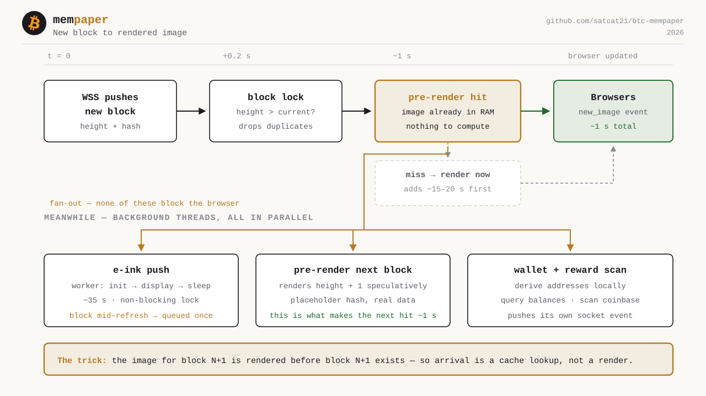

1. The WebSocket pushes the new height and hash.
2. The block lock drops duplicates and anything not newer than current.
3. If a valid pre-render exists for that height, it goes straight to browsers —
   about a second end to end. If not, a fresh render adds roughly 15–20 s.
4. Three background threads then fan out in parallel, none of them blocking the
   browser update: the e-ink push (~35 s), the pre-render for the *next* block,
   and a wallet balance and block-reward rescan.

The e-ink push holds a non-blocking lock. A block landing mid-refresh does not
queue up behind it indefinitely — exactly one follow-up refresh is scheduled, and
any further blocks arriving in that window collapse into it.

---

### Timings

| Job | Interval | Trigger |
|---|---|---|
| Block arrival | ~10 min average | WebSocket push — never polled |
| Pre-cache refresh | 5 min | `precache_update_interval_seconds` |
| Fee, price, hashrate, difficulty | 5 min | Shares the pre-cache pass |
| Bitaxe stats | 5 min, or 30 s while all miners read offline | Pre-cache pass |
| Pre-render next block | after each pass | Data change or block arrival |
| E-ink refresh | ~35 s per block | Hardware-bound SPI + panel refresh |
| Secure cache flush | 30 min | Debounced; immediate on graceful shutdown |
| Session idle timeout | 30 min | Sliding — any authenticated request resets it |
| WebSocket reconnect | 30 s | Fixed backoff after a disconnect |
| Meme sync | weekly | Cron, opt-in |

Data blocks the current layout will not draw are skipped entirely, so the
pre-cache pass does not fetch what nothing is about to show.

---

### See also

- [Configuration Reference](CONFIG_REFERENCE.md) — every setting
- [Security Guide](SECURITY_GUIDE.md) — hardening, threat model, audit checklist
- [Self-Hosting Guide](SELF_HOSTING_GUIDE.md) — Traefik, OIDC, TLS, exposing mempool
- [Cache System](UNIFIED_CACHE_DOCUMENTATION.md) — cache internals
- [Diagram sources](diagrams/README.md) — embedding and regeneration notes
