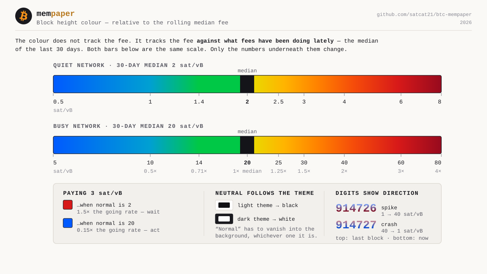

# Configuration Reference

This document provides a comprehensive list of all configuration settings available in mempaper.
These settings can be modified via the Web Dashboard (recommended) or by editing `config/config.json`.

---

## General appearance

| Web Label | Config Key | Type | Description | Allowed Values / Examples |
| :--- | :--- | :--- | :--- | :--- |
| **Language** | `language` | Select | Interface language | `en` (English), `de` (German), `es` (Spanish), `fr` (French), `it` (Italian) |
| **Color Mode** | `color_mode_dark` | Switch | Dark theme for dashboard | `true` (Dark), `false` (Light) |
| **E-Ink Dark Mode** | `eink_dark_mode` | Switch | Invert colors for E-ink | `true` (Inverted/Night), `false` (Standard) |
| **Prioritize Large Memes** | `prioritize_large_scaled_meme` | Switch | Maximize meme size vs info blocks | `true` (Large Memes), `false` (Balanced) |

---

## Color customization

| Web Label | Config Key | Type | Description | Default Light / Dark |
| :--- | :--- | :--- | :--- | :--- |
| **Date Gradient Start** | `color_date_start_light`<br>`color_date_start_dark` | Color | Gradient start color for the date display | `#1c82c0` / `#4FC3F7` |
| **Date Gradient End** | `color_date_end_light`<br>`color_date_end_dark` | Color | Gradient end color for the date display | `#c040a8` / `#BA68C8` |
| **Holiday Start Color** | `color_holiday_start_light`<br>`color_holiday_start_dark` | Color | Gradient start color for holiday events | `#F7931A` / `#F7931A` |
| **Holiday End Color** | `color_holiday_end_light`<br>`color_holiday_end_dark` | Color | Gradient end color for holiday events | `#C62828` / `#FF6F6F` |
| **BTC Price Color** | `color_btc_price_light`<br>`color_btc_price_dark` | Color | Text color for Bitcoin price | `#17805B` / `#00C896` |
| **Countdown Color** | `color_countdown_light`<br>`color_countdown_dark` | Color | Text color for supply countdown | `#C55A00` / `#FF9E40` |
| **Halving Color** | `color_halving_light`<br>`color_halving_dark` | Color | Text color for halving countdown | `#1565C0` / `#4FC3F7` |
| **Network Color** | `color_network_light`<br>`color_network_dark` | Color | Text color for network stats | `#6A1B9A` / `#CE93D8` |
| **Bitaxe Color** | `color_bitaxe_stats_light`<br>`color_bitaxe_stats_dark` | Color | Text color for mining stats | `#B89C1D` / `#FFE566` |
| **Wallet Color** | `color_wallets_light`<br>`color_wallets_dark` | Color | Text color for wallet balances | `#1565C0` / `#09A3BA` |
| **Donation Color** | `color_donation_light`<br>`color_donation_dark` | Color | Text color for donation block | `#F7931A` / `#F7931A` |
| **Block Height Color & Scale** | `color_block_height_light`<br>`color_block_height_dark`<br>`fee_color_mode` | Group | The color an ordinary block reads as, per theme, plus the scale that turns a fee into a color. Edited together under **General → Advanced**, with a live preview of a steady, cheap, spiked and dear network. See [Block height color scale](#block-height-color-scale) | `#3C3C46` / `#C8C8D2`, scale `relative_neutral` |

---

## Mempool integration

| Web Label | Config Key | Type | Description | Allowed Values / Examples |
| :--- | :--- | :--- | :--- | :--- |
| **Mempool Host** | `mempool_host` | String | Mempool instance hostname. A `.onion` address enables Tor automatically and switches to http on port 80, since onion names cannot resolve without a proxy and the circuit already encrypts | `mempool.space` (public), `192.168.1.50` (local), `...onion` (via Tor) |
| **Private/Self-Hosted** | `mempool_is_private` | Switch | Marks the instance as self-hosted on your local network; disables privacy warnings for wallet monitoring | `true` (private), `false` (public, default) |
| **Connect via Tor** | `mempool_use_tor` | Switch | Route mempool traffic through the local Tor daemon (installed by `install.sh`), so a `.onion` host works and the instance never sees your IP. Only mempool traffic is proxied -- Bitaxe miners stay on the LAN. **Turn this off when pointing at a self-hosted mempool on your LAN:** Tor refuses to route private addresses, so a `192.168.x.x` host fails entirely while it is on | `true` (via Tor), `false` (direct, default) |
| **Tor SOCKS Host** | `tor_socks_host` | String | Address of the Tor SOCKS proxy (Advanced) | `127.0.0.1` (default) |
| **Tor SOCKS Port** | `tor_socks_port` | Number | Port of the Tor SOCKS proxy (Advanced) | `9050` (Tor daemon, default), `9150` (Tor Browser) |
| **Use HTTPS/SSL** | `mempool_use_https` | Switch | Secure connection. Not used over Tor -- the onion circuit already encrypts and authenticates, so the setting is disabled while Tor is on | `true` (https://), `false` (http://) |
| **Verify SSL Cert** | `mempool_verify_ssl` | Switch | Validate SSL certificate. Not used over Tor, for the same reason | `true` (Verify), `false` (Skip -- for self-signed) |
| **REST Port** | `mempool_rest_port` | Number | API port. Remembered separately for clearnet and Tor -- see below | `443` (public), `80` (onion), `4081`/`3006` (local mempool, MyNode/Umbrel) |
| **WebSocket Port** | `mempool_ws_port` | Number | Real-time data port. Also remembered per transport | `443` (public), `80` (onion), `8999` (local standard) |
| **WebSocket Path** | `mempool_ws_path` | String | Websocket endpoint path | `/api/v1/ws` (default) |
| **Username** | `mempool_username` | String | Optional Basic auth username | Leave empty if not required |
| **Password** | `mempool_password` | String | Optional Basic auth password | Leave empty if not required |
| **Fee Preference** | `fee_parameter` | Select | Which fee to display | `fastestFee` (High Priority), `halfHourFee` (Standard), `hourFee` (Low Priority), `economyFee` (Economy), `minimumFee` (No Priority) |
| **Fee Baseline Window** | `fee_baseline_days` | Number | Days of history behind "normal" (Advanced) | `3`–`90`, default `30` |
| **Neutral Band** | `fee_neutral_band_pct` | Number | How close to the median still reads as normal (Advanced) | `0`–`50`, default `5` |

### Block height color scale

The block height number is colored by the current fee. The **relative** scales
compare that fee against the median of the last `fee_baseline_days` days rather
than against fixed thresholds, so "cheap" keeps meaning cheap when the whole fee
market moves.

Set the base color and pick the scale together under **General → Advanced →
Block Height Color & Scale**. That panel previews a steady, a still-cheap, a
spiked and a still-dear network in both themes, and its fee colors are computed by
the renderer itself, so what you see is what the panel draws. The two tuning
numbers below — `fee_baseline_days` and `fee_neutral_band_pct` — stay under
**Mempool → Advanced**.



| Mode | Behaviour |
|---|---|
| `relative_neutral` *(default)* | Neutral at the median, cool below it, warm above. Blue → green → **neutral** → yellow → amber → orange → red |
| `relative_rainbow` | One continuous ramp with no neutral point: blue → green → yellow → amber → orange → red |
| `absolute` | The original fixed sat/vB thresholds. Ignores the baseline entirely |

Notes that matter in practice:

- **Both ends of the gradient are fee readings** — the previous block at the top,
  the current one at the bottom — so the digits show the move, not just the level.
- **The base color is yours, one per theme.** See below. It is what an *ordinary*
  block reads as, and defaults to a neutral grey so it does not compete with the
  fee hues on either side of it.
- **The scale is logarithmic.** Each whole step is a doubling, so 1→2 sat/vB
  occupies as much of the range as 20→40. A linear ratio axis would squash the
  entire cheap half into a sliver.
- **1 sat/vB is always the cheapest color**, whatever the baseline says. It is
  the relay minimum — there is nothing cheaper to wait for, so a quiet week that
  drags the median down to 1 must not make 1 read as merely "normal".
- **The median is used, not the mean.** One inscription weekend at 300 sat/vB
  would drag a mean upward for a month and make genuinely expensive blocks look
  ordinary; the median barely moves.
- **No baseline yet, no guessing.** Under 12 samples in the window, the relative
  modes fall back to the absolute table rather than inventing a ratio.

Baseline history lives in `cache/fee_history.json`. It fills itself from the
blocks mempaper already polls, and is backfilled from
`/v1/mining/blocks/fee-rates` where the mempool instance has block indexing
enabled — a self-hosted instance without the mining module simply accumulates
locally instead, warmed on first run from the last ~15 blocks.

#### The base color

`color_block_height_light` and `color_block_height_dark` set the color an
**ordinary** block reads as — one within `fee_neutral_band_pct` of the median,
which has nothing to report. Each end of the gradient falls back to it
independently, so it can appear at the top, the bottom, or both.

Both ends are fee readings: the previous block at the top, the current one at the
bottom. Tone follows the theme, so the bottom — where the fee label sits — is
always the readable end:

| Theme | Top (last block) | Bottom (this block) |
|---|---|---|
| Dark | full value | 45% toward white |
| Light | 45% toward white | 15% toward black |

A substituted end takes the tone of the end it lands on, except where that end is
the theme's anchor — the top on dark, the bottom on light — where the picked color
is drawn exactly, so the color picker always shows something that appears on screen.

Worked example against a 20 sat/vB median. These are the values the renderer
actually emits for a web image:

| Move | Reads as | Light theme (`#3C3C46`) | Dark theme (`#C8C8D2`) |
|---|---|---|---|
| 20 → 20 | ordinary, both blocks | `#939399` → `#3C3C46` | `#C8C8D2` → `#E0E0E6` |
| 8 → 8 | cheap, and staying cheap | `#72BEED` → `#0074BE` | `#0089E0` → `#72BEED` |
| 8 → 40 | just spiked | `#72BEED` → `#D14B05` | `#0089E0` → `#FAA376` |
| 40 → 8 | just crashed | `#FAA376` → `#0074BE` | `#F75907` → `#72BEED` |
| 40 → 40 | dear, and staying dear | `#FAA376` → `#D14B05` | `#F75907` → `#FAA376` |

The fee ends are deliberately softened from the raw scale — deepened on a light
theme, lightened on a dark one — so a dashboard full of color stays legible
instead of shouting. Any hex works for the base color; a neutral grey is only the
default because "nothing to report" should not draw the eye.

The ramp spans the digits themselves — the cap top to the baseline — so half the
glyph height is an even blend of the two, and both ends are drawn at full strength.
Mapping it onto the text layout box instead would waste the ends of the ramp on the
descender space digits never occupy, leaving the top 17% pre-blended and the bottom
26% short.

On e-ink the two ends snap to inks the panel actually has, and the background ink
is excluded from the choice — white on a light panel, black on a dark one — since
snapping to the background would erase the digits. Both ends can land on the same
ink, which is correct: the panel has no tone in between to show.

#### Custom thresholds for `absolute`

`fee_color_stops` (file-only) replaces the built-in table:

```json
"fee_color_stops": [[0, "#00d250"], [10, "#82d20a"], [30, "#ffa000"], [120, "#e61414"]]
```

Pairs of `[sat/vB, "#rrggbb"]`, interpolated in between. A malformed list falls
back to the built-in table whole rather than partially, so a typo cannot leave
you with a half-custom scale.

### Ports are remembered per transport

Clearnet and Tor each keep their own ports permanently, and the **Connect via
Tor** switch decides which pair is live. Toggling Tor therefore never destroys a
custom port: switch on, and the fields change to the Tor pair; switch off, and
your previous values come back exactly as they were.

| Config Key | Default | Applies when |
| :--- | :--- | :--- |
| `mempool_use_https_clearnet` | `true` | Tor **off** |
| `mempool_rest_port_clearnet` | `443` | Tor **off** |
| `mempool_ws_port_clearnet` | `443` | Tor **off** |
| `mempool_rest_port_tor` | `80` | Tor **on** |
| `mempool_ws_port_tor` | `80` | Tor **on** |

Editing a port writes to whichever slot is active, so a value typed while Tor is
on belongs to the Tor slot and leaves the clearnet one untouched. `mempool_use_https`,
`mempool_rest_port` and `mempool_ws_port` are the *live* values projected from the
active slot — those are what the rest of the app reads.

There is no HTTPS setting for Tor. An onion address **is** the service's public
key, so the circuit already encrypts and authenticates the endpoint; TLS on top
would add handshake cost a Pi Zero can ill afford and protect nothing. Tor
traffic is always plain HTTP.

Selecting a **known onion preset** overrides the Tor slot's port, because the
service dictates its own: a port carried over from a clearnet instance would be
refused by a hidden service listening on 80.

---

## Display hardware

| Web Label | Config Key | Type | Description | Allowed Values / Examples |
| :--- | :--- | :--- | :--- | :--- |
| **E-Ink Display Connected** | `e-ink-display-connected` | Switch | Enable hardware driver | `true` (Enable), `false` (Disable) |
| **Display Driver** | `omni_device_name` | String | Driver name (Native or Omni-EPD) | `epd13in3E` (Recommended -- Waveshare 13.3"), `epd7in3f` (Default -- Waveshare 7.3"), `inky.impression`, `inky.auto` |
| **Display Width** | `display_width` | Number | Resolution Width (pixels) -- Auto-set by device selection | Automatically determined from the selected device. Held landscape-native; the canvas is always rendered portrait |
| **Display Height** | `display_height` | Number | Resolution Height (pixels) -- Auto-set by device selection | Automatically determined from the selected device. Held landscape-native; the canvas is always rendered portrait |
> **Changing the display model is not possible from this page.** The selector shows the configured model read-only; it can download missing drivers for that model, but not switch to another. Re-run `install.sh`, or `sudo -u mempaper .venv/bin/python tools/configure_display.py`.

### Automatic disable and recovery

Three consecutive refresh failures — a wrong driver, an SPI error, a dead panel —
switch `e-ink-display-connected` off and persist it, so the device stops retrying
a display that cannot work.

**The next service restart or reboot turns it back on and tries again.** Without
that, a transient fault leaves the panel dark permanently and the only cure is
the dashboard, which is no help on a device handed to someone who never logs in.
A retry costs at most three failed refreshes before the threshold trips again, so
a genuinely dead panel does not spin.

Only an automatic disable is retried. Switching the display off yourself in
Settings clears `eink_auto_disabled`, and a reboot then leaves it off — your
choice is never overridden. The marker is also cleared the moment a refresh
succeeds.

---

## Bitcoin price block

| Web Label | Config Key | Type | Description | Allowed Values / Examples |
| :--- | :--- | :--- | :--- | :--- |
| **Show Price Block** | `show_btc_price_block` | Switch | Display fiat price info | `true`, `false` |
| **Currency** | `btc_price_currency` | Select | Fiat currency | `USD`, `EUR`, `GBP`, `CAD`, `CHF`, `AUD`, `JPY` |
| **Moscow Time Unit** | `moscow_time_unit` | Select | Format for Sats/Fiat | `sats` (e.g. 3432 sats), `hour` (e.g. 03:42) |

---

## Bitaxe / mining stats

| Web Label | Config Key | Type | Description | Allowed Values / Examples |
| :--- | :--- | :--- | :--- | :--- |
| **Show Bitaxe Block** | `show_bitaxe_block` | Switch | Display mining block | `true`, `false` |
| **Bitaxe Display Mode** | `bitaxe_display_mode` | Select | What to show on right side | `blocks` (Found Blocks), `difficulty` (Best Difficulty) |
| **Miner Table** | `bitaxe_miner_table` | List | Miner IP addresses | `[{"address": "192.168.1.20", "comment": "Axe 1"}]` |
| **Block Rewards Table** | `block_reward_addresses_table` | List | Addresses to watch for coinbase | `[{"address": "bc1q...", "comment": "Solo Pool"}]` |

---

## Wallet monitoring

| Web Label | Config Key | Type | Description | Allowed Values / Examples |
| :--- | :--- | :--- | :--- | :--- |
| **Show Wallet Block** | `show_wallet_balances_block` | Switch | Display wallet balance info | `true`, `false` |
| **Wallet Table** | `wallet_balance_addresses_with_comments` | List | Addresses/XPUBs to watch | `[{"address": "xpub...", "type": "xpub", "comment": "Cold Storage"}]` |
| **Display Unit** | `wallet_balance_unit` | Select | Unit for balance | `sats`, `btc` |
| **Fiat Currency** | `wallet_balance_currency` | Select | Fiat value currency | `USD`, `EUR`, `GBP`, `CAD`, `CHF`, `AUD`, `JPY` |

---

## BTC countdown block

| Web Label | Config Key | Type | Description | Allowed Values / Examples |
| :--- | :--- | :--- | :--- | :--- |
| **Show Countdown Block** | `show_countdown_block` | Switch | Display remaining BTC supply and % mined | `true`, `false` |

---

## Halving block

| Web Label | Config Key | Type | Description | Allowed Values / Examples |
| :--- | :--- | :--- | :--- | :--- |
| **Show Halving Block** | `show_halving_block` | Switch | Display next halving date and block countdown | `true`, `false` |

---

## Network block

| Web Label | Config Key | Type | Description | Allowed Values / Examples |
| :--- | :--- | :--- | :--- | :--- |
| **Show Network Block** | `show_network_block` | Switch | Display global hashrate and mining difficulty | `true`, `false` |

---

## Donation block

Displays the latest (or largest) Lightning donation received via a LNbits webhook. Requires a webhook URL to be configured -- either a direct connection (same network) or via a self-hosted [event-hub](https://github.com/satcat21/event-hub) relay.

| Web Label | Config Key | Type | Description | Allowed Values / Examples |
| :--- | :--- | :--- | :--- | :--- |
| **Show Donation Block** | `show_donation_block` | Switch | Display Lightning donation block | `true`, `false` |
| **Display Mode** | `donation_display_mode` | Select | Which donation to show | `latest` (most recent), `highest` (largest ever), `auto` (latest then largest after 432 blocks) |
| **Webhook Relay URL** | `webhook_relay_ws_url` | String | WebSocket URL for Option B relay | `wss://your-host/ws/your-token` (leave empty for direct webhook) |

---

## Software updates

| Web Label | Config Key | Type | Description | Allowed Values / Examples |
| :--- | :--- | :--- | :--- | :--- |
| **Automatic Updates** | `auto_update_enabled` | Switch | Enable scheduled automatic updates | `true`, `false` (default: `false`) |
| **Update Time** | `auto_update_time` | Time | Time of day to run automatic updates | `HH:MM` format, e.g. `03:00` (default), `14:30` |
| **Update Days** | `auto_update_days` | Multi-select | Days of the week to check for updates | `["mon", "wed", "fri"]` (default). Valid: `mon`, `tue`, `wed`, `thu`, `fri`, `sat`, `sun` |

When automatic updates are enabled, mempaper checks for new releases at the configured time on the selected days. If a newer release is available, it is installed automatically and the service restarts. The restart is delayed if the e-ink display is currently refreshing to prevent display corruption.

---

## Meme sync

Fetches new memes from einundzwanzig-memes.space on a weekly schedule, via a
cron entry for the `mempaper` user that mempaper writes and keeps in step with
these settings.

| Web Label | Config Key | Type | Description | Allowed Values / Examples |
| :--- | :--- | :--- | :--- | :--- |
| **Weekly Meme Sync** | `meme_sync_enabled` | Switch | Enable the scheduled download | `true`, `false` (default) |
| **Sync Day** | `meme_sync_day` | Select | Day of the week, in cron numbering | `"0"` (Sun) … `"6"` (Sat), default `"4"` (Thu) |
| **Sync Hour** | `meme_sync_hour` | Select | Hour of the day, 24-hour | `"0"` … `"23"`, default `"13"` |
| **Download over Tor** | `tor_meme_downloads` | Switch | Append `--tor` so the download uses the Tor SOCKS proxy, keeping your IP off the meme host too | `true`, `false` (default) |

**`install.sh` randomises the day and hour per device** at install time and sets
`meme_sync_schedule_randomised` so it never does so again. Without that, every
mempaper in the world would inherit the same Thursday 13:00 default and hit
einundzwanzig-memes.space in the same hour. Changing the schedule in the web UI
overrides it and is never overwritten by a later install run.

> The sync script (`tools/sync_memes.py`) is currently a **placeholder** —
> the upstream API endpoint does not exist yet. A scheduled run reports what it
> would have done and exits 0, so the job shows as succeeding rather than
> failing in the cron log until the implementation lands.

---

## OPSec mode

When OPSec Mode is enabled the e-ink display shows a randomly selected cover image (e.g. a family photo) instead of Bitcoin data. The web dashboard is **not** affected and always shows normal BTC data.

Upload OPSec images via the **Meme Management** section of the config page, in the **OPSec Images** sub-section below the meme gallery.

| Web Label | Config Key | Type | Description | Allowed Values / Examples |
| :--- | :--- | :--- | :--- | :--- |
| **OPSec Mode** | `opsec_mode_enabled` | Switch | Show cover image on e-ink instead of BTC data | `true` (OPSec on), `false` (normal, default) |

---

## Security and admin

| Web Label | Config Key | Type | Description | Allowed Values / Examples |
| :--- | :--- | :--- | :--- | :--- |
| **Admin Username** | `admin_username` | String | Dashboard login username | default: `admin` |
| **Password** | `admin_password_hash` | String | *Hashed managed field* | *Managed by `setup_secure_password.py`* |
| **Public Dashboard** | `public_dashboard` | Switch | Allow unauthenticated users to view the dashboard (settings still require login) | `true`, `false` (default: `false`) |

### Network-bound encryption (Tang)

Found under **Settings → General → Advanced**. Seals wallet addresses, balance
caches, the donation history and the rendered images with a key held on a Tang
server on your LAN, so a stolen device cannot decrypt them — carried off the
network there is nothing to guess. Requires the `clevis` package, which
`install.sh` installs whether or not you use this.

| Web Label | Config Key | Type | Description | Allowed Values / Examples |
| :--- | :--- | :--- | :--- | :--- |
| **Network-Bound Encryption (Tang)** | `tang_enabled` | Switch | Seal sensitive data against a Tang server. If the server is unreachable the device still boots, the affected blocks are disabled, and they restore themselves when it returns | `true`, `false` (default: `false`) |
| **Tang Server URL** | `tang_url` | String | Address of the Tang server on your LAN. Never expose it to the internet — reachability *is* the access control | `http://192.168.1.50:7500` |
| **Tang Key Thumbprint** | `tang_thumbprint` | String | Signing-key thumbprint, from `tang-show-keys`. Pinning it stops anything else on the LAN impersonating the server. Empty means trust-on-first-use | `faYWs5gMZ4MOKVmw_70zIvgZuzPd6AZnrsF86OgewnI` |
| **Check Tang Connection** | *(button)* | Action | Tests the whole path against the values in the form: reaches the server, reads its signing key, then seals and unseals a throwaway key. Writes nothing | — |

> **Enable this before entering wallet addresses.** Deleted data lingers in freed
> flash blocks, so sealing later cannot reach xpubs already written to the card in
> clear text. See
> [Self-Hosting Guide → Tang](SELF_HOSTING_GUIDE.md#part-8--tang-network-bound-encryption-for-wallet-data-optional).

> **Turning it off needs the server.** Disabling rewrites every sealed file in the
> clear, which requires the key. If the Tang server is gone for good the web UI
> offers to discard the sealed data instead — permanently, after confirmation
> listing exactly what is lost.

What gets sealed when `tang_enabled` is on:

| File | Contents |
| :--- | :--- |
| `config/config.sensitive.json` | Wallet addresses and xpubs |
| `cache/cache.sensitive.json` | Balance and block-reward caches |
| `cache/async_wallet_address_cache.sensitive.json` | Derived wallet addresses |
| `cache/donations.json` | Lightning donation history |
| `cache/current.png`, `cache/current.webp` | Rendered dashboard image |
| `cache/current_eink.png` | Rendered e-ink image |

`config/tang_key.jwe` holds the sealed data key (mode `0600`). It is useless
without the Tang server. **Back up the server's key store** — `/var/lib/tang` on
Debian 13, `/var/db/tang` on Debian 12 — because losing it makes every sealed
device unrecoverable.

Not covered by Tang: `admin_password_hash`, `admin_users`, `secret_key` and
`mempool_password` stay readable so the device can boot and be logged into while
the server is unreachable. The password hashes are Argon2id and safe to store
openly; the other two are secrets, and that trade is deliberate.

---

## Advanced (file-only)

These settings are typically managed by the system or only available in `config.json` directly.

Editing them by hand is the normal way to use them: **stop the service first**
(`sudo systemctl stop mempaper`), edit `config/config.json`, start it again.
Saving anything in the web UI rewrites the whole file from memory, so an edit
made while the service is running can be overwritten without warning.

| Config Key | Type | Default | Accepted values | Description |
| :--- | :--- | :--- | :--- | :--- |
| `precache_update_interval_seconds` | Number | `300` | Any number of seconds above `0` | How often the background loop refreshes price, Bitaxe, network and fee data. Lower = fresher data but more CPU and API calls. 300s is tuned for a Pi Zero |
| `precache_render_max_age_seconds` | Number | `120` | Any number of seconds above `0`; keep below the update interval | How stale cached price, Bitaxe or network data may be when an image is rendered before it is fetched again. Below the update interval on purpose: a current image is worth more than a saved request |
| `precache_fee_max_age_seconds` | Number | `90` | Any number of seconds above `0` | Same, for fees. Shorter because fees move fastest |
| `bitaxe_offline_retry_seconds` | Number | `30` | Any number of seconds above `0` | When every configured miner reports offline, retry after this instead of the full interval — that reading is often just the LAN not being up yet after a reboot |
| `cache_metadata_write_interval_seconds` | Number | `300` | Any number of seconds above `0` — `0` does **not** mean "always", it falls back to the default | Debounce for cache-metadata writes, limiting SD card wear |
| `disable_config_file_watching` | Boolean | `false` | `true`, `false` | Disable automatic config reload on file change. Set to `true` for faster startup on development machines |
| `network_outage_tolerance_minutes` | Number | `45` | `5`–`10080` minutes | Minutes to retry WebSocket reconnection during outages. Read by the backup tool's WebSocket client, not by the block monitor, which retries with its own backoff for as long as it runs |
| `tor_auto_restart` | Boolean | `false` | `true`, `false` | Last rung of the Tor recovery ladder: after ~35 minutes in which nothing has reached the mempool host over Tor, let mempaper restart the tor service. Needs a sudoers rule that `install.sh` does not write — mempaper logs the exact line when the rung is first reached. The two cheaper rungs (rotating the SOCKS circuit, then `SIGNAL NEWNYM`) need no configuration and run regardless |
| `xpub_enable_gap_limit` | Boolean | `true` | `true`, `false` | Stop scanning XPUB after N unused addresses |
| `xpub_gap_limit_last_n` | Number | `20` | `5`–`100` addresses | Number of consecutive empty addresses before stopping scan |
| `xpub_gap_limit_increment` | Number | `10` | `1`–`50` addresses | How many addresses to scan per increment step |
| `xpub_enable_bootstrap_search` | Boolean | `false` | `true`, `false` | Perform a wider initial address scan to find all used addresses (slower but more thorough) |
| `xpub_bootstrap_max_addresses` | Number | `100` | `20`–`1000` addresses | Maximum addresses to scan during bootstrap search |
| `xpub_bootstrap_increment` | Number | `10` | `1`–`50` addresses | Addresses per step during bootstrap search |
| `font_regular` | String | `static/fonts/Roboto-Regular.ttf` | Path to a `.ttf`, relative to the app directory or absolute | Path to regular font file |
| `font_bold` | String | `static/fonts/Roboto-Bold.ttf` | Path to a `.ttf`, relative to the app directory or absolute | Path to bold font file |
| `eink_auto_disabled` | Boolean | `false` | `true`, `false` — written by the app, not normally set by hand | Set when three consecutive refresh failures switch the display off, so startup knows the shutdown was automatic rather than the operator's choice. See [Display hardware](#display-hardware) |
| `meme_sync_schedule_randomised` | Boolean | *(set by `install.sh`)* | `true`, `false` | Marks that the installer has already picked a random day and hour for this device, so a later install run leaves your schedule alone. See [Meme sync](#meme-sync) |

A value outside its accepted range is **discarded, not clamped**: the range-checked
keys are dropped by validation and the timing keys fall back inside the pre-cache
loop. Either way the shipped default applies and nothing warns you, so confirm a
hand-edited setting took effect rather than assuming it did.
